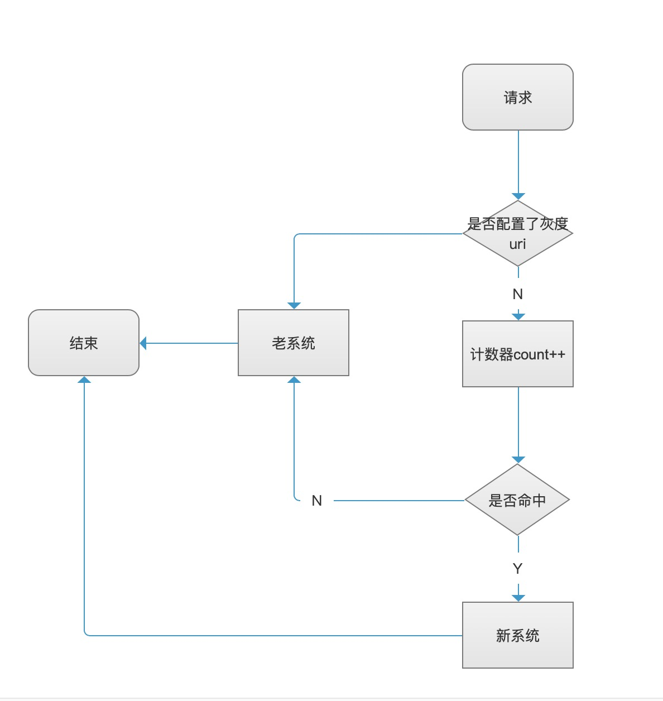
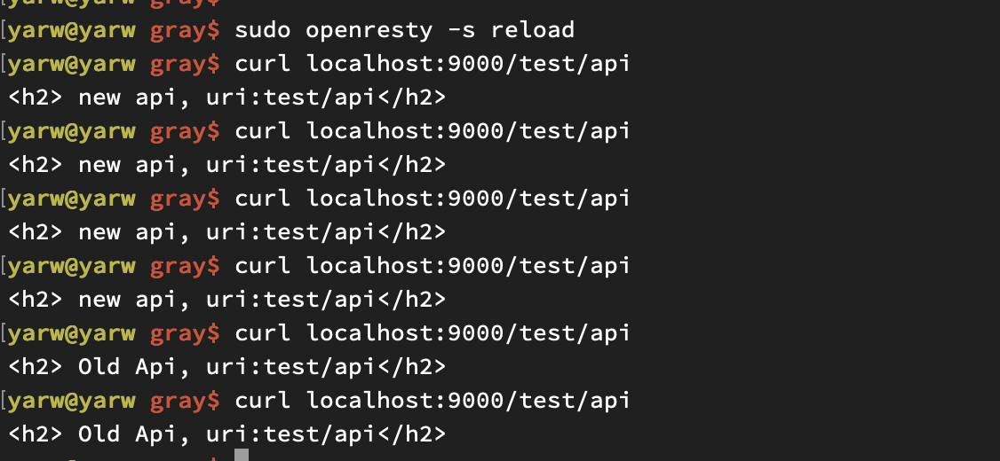

## 基于openresty开发轻量级,按流量控制的灰度模块
---
### 1.为什么要灰度发布
* 解决系统重构老系统向新系统平滑迁移
* 按流量控制灰度,可以降低风险,有问题只影响极少了用户

### 2.设计思路
* 大致流程图,利用lua开发nginx模块动态路由控制,采用请求计数器,弱流量在流控范围内,走新系统,否则走老系统。
 
 
### 3.实现代码
* 灰度配置文件
```shell script
-- Copyright (C) www.bytearch.com (iyw)
local _M = {
    _VERSION = "0.0.2"
}
-- 灰度级别 0: 按流量比转发  1: 100%流量转发到新系统  2: 100%流量转发到老系统
local proxy_sys_level = 0;

-- 流量控制级别 可调整 当 proxy_sys_level = 0 时生效
-- 0.01%  new = 1, base = 10000
-- 0.1%  new = 1, base = 1000
-- 0.1%  new = 1, base = 100
-- 10%  new = 10, base = 100
-- 100% new = 100, base = 100
local proxy_percent = {
    new = 1, base = 1000
}

-- 灰度uri配置 此处也可以从配置中心 | redis| 文件 等中获取
local proxy_uri_list = {
    ["/test/api"] = true
}

-- ip白名单 该ip 100%转发到新系统(主要为了方便测试)
local white_ip_list = {
    -- "192.168.0.1"
}
-- 100%转发到新系统uri配置 (可能有些接口需要指定转发到新系统)
local must_proxy_new_uri_list = {
    -- ["/write"] = true,
}
--old
local old_upstream = "proxy_old"
--new
local new_upstream = "proxy_new"

_M['proxy_sys_level'] = proxy_sys_level
_M['proxy_percent'] = proxy_percent
_M['white_ip_list'] = white_ip_list
_M['must_proxy_new_uri_list'] = must_proxy_new_uri_list
_M['proxy_uri_list'] = proxy_uri_list
_M['old_upstream'] = old_upstream
_M['new_upstream'] = new_upstream

return _M
```
* 解释一下配置

|配置             |作用         |           说明           |
|-------------------|-------- |-------------------------------|
|  proxy_sys_level |  全局开关 | 0：开启灰度  1:转发到新系统  2:转发到老系统   |
|  proxy_percent   | 灰度比例配置|  new = 1, base = 100 则表示1%流量转发到新系统|
|  proxy_uri_list  | 灰度uri配置| 配置了才会走灰度,否则直接走老系统|
|  white_ip_list | 白名单ip |  指定走新系统ip|
|  must_proxy_new_uri_list| 白名单uri| 指定走新系统uri|

* 灰度模块开发
```shell script
    -- Copyright (C) www.bytearch.com (iyw)
    local config = require("gray.config")
    
    -- 按流量灰度
    local _M = {
        _VERSION = "0.0."
    }
    -- request count
    local req_count = 0;
    
    local uri_req_count_map = {}
    
    local function _getRequestUri()
        local uri = ngx.var.uri
        return uri
    end
    -- write api transmit to new api
    local function _isProxyNewMust()
        local proxy_new_uri_list = config['must_proxy_new_uri_list']
        if proxy_new_uri_list[_getRequestUri()] then
            return true
        end
        return false;
    end
    
    local function _checkWhiteReq()
        local headers = ngx.req.get_headers()
        local white_ip_list = config['white_ip_list']
        local ip = headers["X-REAL-IP"] or headers["X_FORWARDED_FOR"] or ngx.var.remote_addr or "0.0.0.0"
        for _, v in ipairs(white_ip_list) do
            if v == ip then
                return true
            end
        end
        return false
    end
    
    local function _getReqCnt()
        req_count = req_count + 1
        return req_count;
    end
    
    local function _getReqCountByKey(key)
        local req_count = uri_req_count_map[key]
        if req_count == nil then
            req_count = 0
        end
        uri_req_count_map[key] = req_count + 1
        return uri_req_count_map[key]
    end
    
    local function _getUpstreamByUriAndCount()
        local proxy_sys_level = config['proxy_sys_level']
        local old_upstream = config['old_upstream']
        local new_upstream = config['new_upstream']
        local proxy_percent = config['proxy_percent']
        -- system level
        if proxy_sys_level == 2 then
            return old_upstream
        elseif proxy_sys_level == 1 then
            return new_upstream
        else
            if _checkWhiteReq() == true then
                return new_upstream
            end
            -- write first
            if _isProxyNewMust() == true then
                return new_upstream
            end
            local uri = _getRequestUri()
            -- proxy cantain uri
            local proxy_uri_list = config['proxy_uri_list']
            if uri and proxy_uri_list[uri] then
                local count = _getReqCountByKey(uri)
                if (count % proxy_percent.base) < proxy_percent.new then
                    return new_upstream
                end
            end
            return old_upstream
        end
    end
    
    function _M.init()
        local upstream = _getUpstreamByUriAndCount();
        ngx.var.backend = upstream
    end
    return _M
```

### 4.测试
* test_old.conf 9001端口
```shell script
server{
    listen 9001;
    server_name localhost;
    index index.html index.do;
    access_log logs/index_access.log;
    error_log  logs/index_error.log info;
    charset utf-8;
    default_type 'text/html';

    location ~ /write {
        content_by_lua '
            ngx.say("old write api")
        ';
    }

    location ~ /(.*){
        set $proxy_uri $1;
        content_by_lua '
            ngx.say("<h2> Old Api, uri:", ngx.var.proxy_uri , "</h2>")
        ';
    }
}
```

* test_new.conf 9002端口
```shell script
server{
    listen 9002;
    server_name localhost;
    index index.html index.do;
    access_log logs/index_access.log;
    error_log  logs/index_error.log info;
    charset utf-8;
    default_type 'text/html';

    location ~ /write {
        content_by_lua '
            ngx.say("new write api")
        ';
    }

    location ~ /(.*){
        set $proxy_uri $1;
        content_by_lua '
            ngx.say("<h2> new api, uri:", ngx.var.proxy_uri, "</h2>")
        ';
    }
}
```
* 反向代理 9000端口
```shell script
#此处配置新老系统地址
upstream proxy_old {
    server localhost:9001 max_fails=3 fail_timeout=2s;
    keepalive 32;

}
upstream proxy_new {
    server localhost:9002 max_fails=3 fail_timeout=2s;
    keepalive 32;
}
server{
    listen 9000;
    server_name localhost;
    index index.html index.do;
    access_log logs/index_access.log;
    error_log  logs/index_error.log info;
    charset utf-8;
    default_type 'text/html';
    ## 注意: lua_code_cache需要设置为on
    lua_code_cache on;

    location ~* /(.*) {
        proxy_set_header Upgrade $http_upgrade;
        proxy_set_header Connection "upgrade";
        proxy_set_header Host $http_host;
        proxy_set_header X-Real-IP $remote_addr;
        proxy_set_header X-Forwarded-For $proxy_add_x_forwarded_for;
        proxy_http_version 1.1;
        set $backend "proxy_old";
        rewrite_by_lua_block  {
              local proxy = require("gray.proxy");
              if proxy then
                   proxy.init()
              end
        }
        proxy_pass http://$backend;
    }
}
```
* 更改配置proxy_percent.new = 5,  proxy_percent.base = 100 (即5%流量转发到新系统)
* 启动openresty
```shell script
openresty -c /usr/local/openresty/nginx/conf/nginx.conf 
```
测试如下


### 5.总结:
  实际场景可能更为复杂,比如可能会根据请求参数灰度策略,这些都可以根据实际很容易情况定制开发。
源代码请移步(https://github.com/bytearch/gray) 欢迎star,谢谢大家!
