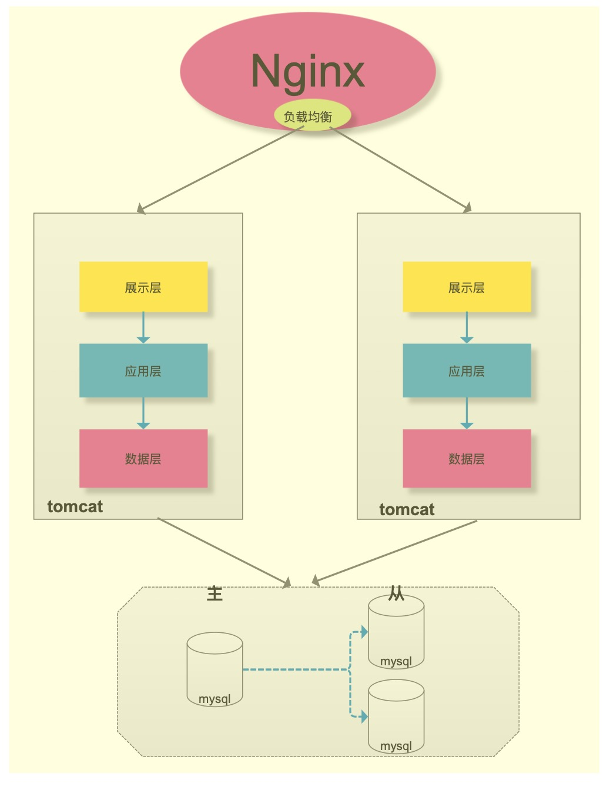
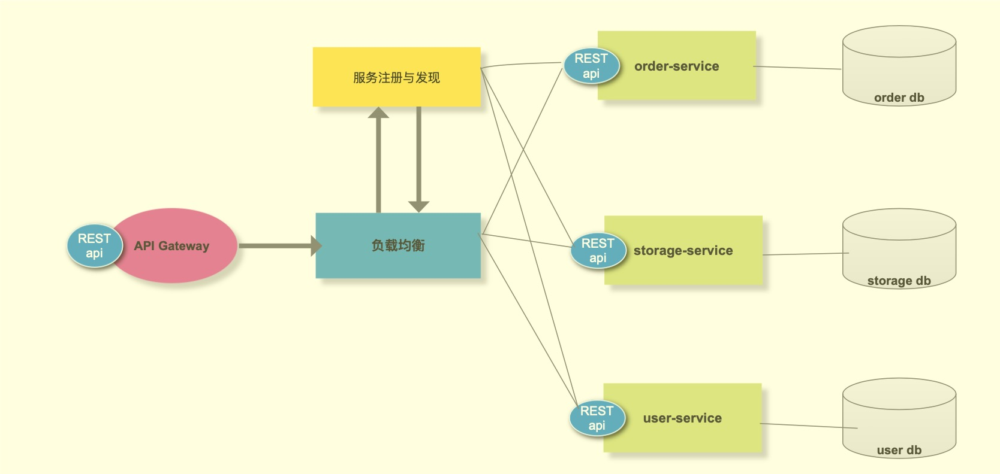
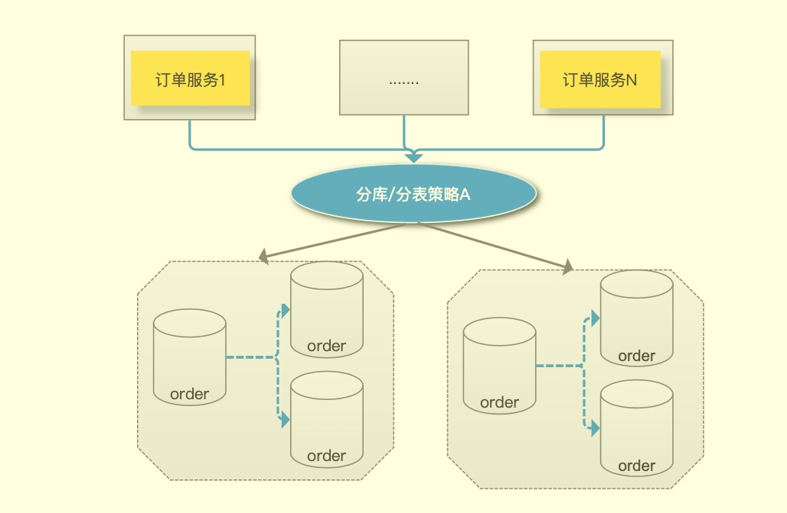
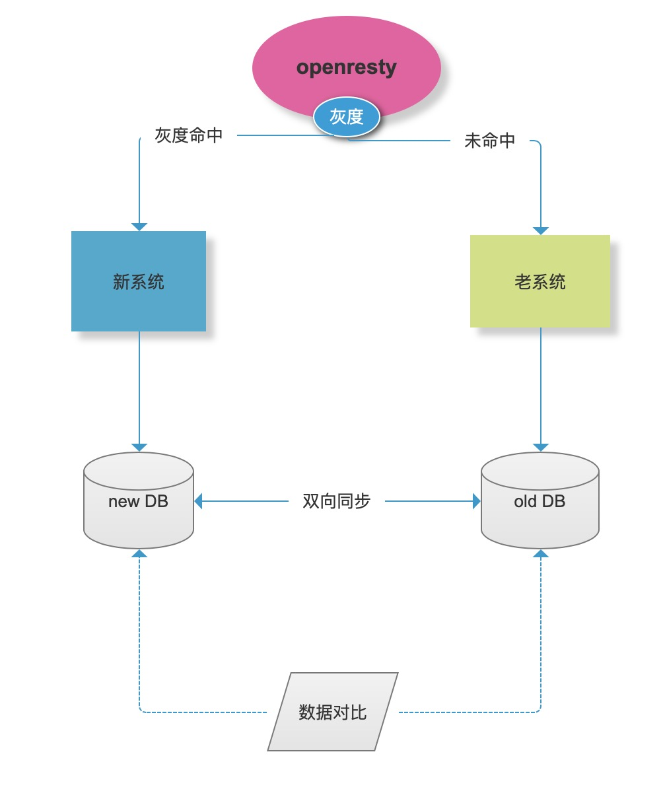

## 浅谈千万级系统重构系列
----

 ###  一、概述
 
  不知不觉,2020已经要过去一半了,实属惶恐!今天给定了个flag,准备写一套系列文章《浅谈千万级系统重构》,抛开微服务技术栈不谈(未来将是另外一个系列)
曾经简单的写过一篇《重构方案设计》,该系列文章相当于改篇文章的具体落地方案,目标本月完成。
 ### 二、重构那些事
 
 * 单体架构
 
随着业务的发展,单体架构问题逐渐暴露
1) 业务越来越复杂，单体架构扩展性不足，业务扩展带来的代价越来越大
2) 数据库单点写入瓶颈,mysql数据量太大查询效率不高
3) 改动一个点可能导致其它地方出问题
所以系统重构显得尤为重要!
* 微服务架构

数据库层一般会分库/分表,以订单系统为例

### 三、如何从单体架构过渡到微服务架构

* 入口层采用按流量灰度，流量逐步增大,降低风险
* db层双向同步,一单有问题可以随时回滚到老系统,并且一般情况下新系统会分库分表
* 数据对比工具,实时/手动对比数据是否一致,提前发现潜在的问题

### 四、内容概况
大致罗列了一下大概有如下内容点:
 * 1. 基于openresty开发轻量级,按流量控制的灰度模块
 * 2. 浅谈mysql分库分表那些事儿
 * 3. 浅谈唯一Id生成器最佳实践
 * 4. 浅谈基于MQ&binlog同步数据双写方案
 * 5. 浅谈数据双写之对比工具实现方案   
 敬请期待。
  
### 五、总结
   记得第一次做千万订单系统重构(2016年),我们老大说了这样一句话:"重构这样的事，一辈子干一次就够了",确实,重构会遇到各种奇葩的问题,并且需要很多前期准备工作
比如:模块拆分,权限回收,SQL改造等等。但是解决了这些问题，也会乐在其中。在这里,感谢那些曾经一起奋斗过的小伙伴,感谢那些帮助过我的同事，谢谢!
